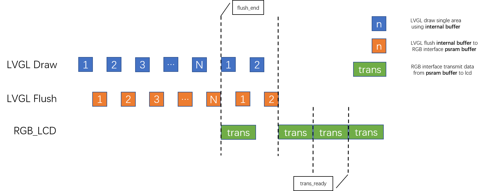
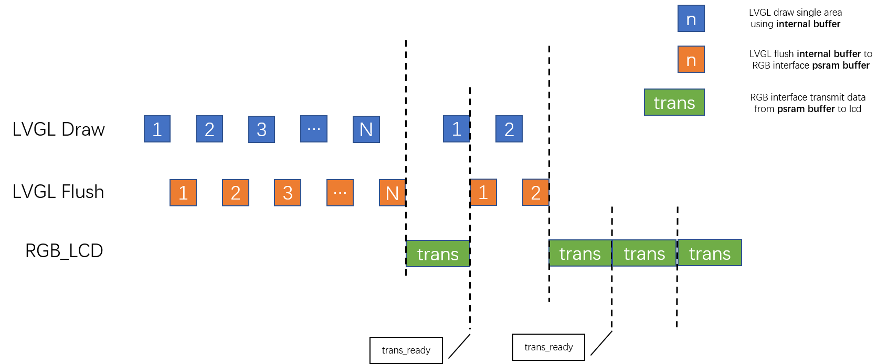

| Supported Targets | ESP32-S3 |
| ----------------- | -------- |

# RGB LCD Panel Example

[esp_lcd](https://docs.espressif.com/projects/esp-idf/en/latest/esp32/api-reference/peripherals/lcd.html) supports RGB interfaced LCD panel, with one or two frame buffer(s) managed by the driver itself.

This example shows the general process of installing an RGB panel driver, and displays a scatter chart on the screen based on the LVGL library. For more information about porting the LVGL library, please refer to [official porting guide](https://docs.lvgl.io/master/porting/index.html). This example uses two synchronization schemes with two semaphores(*flush_end, trans_ready*) to solve the tearing problem:
**[Tearing fix:]**

**[Tearing fix critical:]**


## How to use the example

### Hardware Required

* An ESP development board, which has RGB LCD peripheral supported and PSRAM onboard
* A general RGB panel, 16 bit-width, with HSYNC, VSYNC and DE signal
* An USB cable for power supply and programming

### Hardware Connection

The connection between ESP Board and the LCD is as follows:

```
       ESP Board                           RGB  Panel
+-----------------------+              +-------------------+
|                   GND +--------------+GND                |
|                       |              |                   |
|                   3V3 +--------------+VCC                |
|                       |              |                   |
|                   PCLK+--------------+PCLK               |
|                       |              |                   |
|             DATA[15:0]+--------------+DATA[15:0]         |
|                       |              |                   |
|                  HSYNC+--------------+HSYNC              |
|                       |              |                   |
|                  VSYNC+--------------+VSYNC              |
|                       |              |                   |
|                     DE+--------------+DE                 |
|                       |              |                   |
|               BK_LIGHT+--------------+BLK                |
+-----------------------+              |                   |
                               3V3-----+DISP_EN            |
                                       |                   |
                                       +-------------------+
```

The GPIO number used by this example can be changed in [rgb_lcd_example_main.c](main/rgb_lcd_example_main.c).

Especially, please pay attention to the level used to turn on the LCD backlight, some LCD module needs a low level to turn it on, while others take a high level. You can change the backlight level macro `EXAMPLE_LCD_BK_LIGHT_ON_LEVEL` in [rgb_lcd_example_main.c](main/rgb_lcd_example_main.c).

If the RGB LCD panel only supports DE mode, you can even bypass the `HSYNC` and `VSYNC` signals, by assigning `EXAMPLE_PIN_NUM_HSYNC` and `EXAMPLE_PIN_NUM_VSYNC` with `-1`.

### Configure

Run `idf.py menuconfig` and go to `Example Configuration`:

1. Choose whether to `Use double Frame Buffer`
2. Choose whether to `Avoid tearing effect` (available only when step `1` was chosen to false)
3. Choose whether to `Avoid tearing effect critically` (available only when step `2` was chosen to true)
4. Choose whether to `Use bounce buffer` (available only when step `1` was chosen to false)

### Build and Flash

Run `idf.py -p PORT build flash monitor` to build, flash and monitor the project. A scatter chart will show up on the LCD as expected.

The first time you run `idf.py` for the example will cost extra time as the build system needs to address the component dependencies and downloads the missing components from registry into `managed_components` folder.

(To exit the serial monitor, type ``Ctrl-]``.)

See the [Getting Started Guide](https://docs.espressif.com/projects/esp-idf/en/latest/get-started/index.html) for full steps to configure and use ESP-IDF to build projects.

### Example Output

```bash
...
I (0) cpu_start: Starting scheduler on APP CPU.
I (856) esp_psram: Reserving pool of 32K of internal memory for DMA/internal allocations
I (856) example: Create semaphores
I (866) example: Turn off LCD backlight
I (866) gpio: GPIO[4]| InputEn: 0| OutputEn: 1| OpenDrain: 0| Pullup: 0| Pulldown: 0| Intr:0
I (876) example: Install RGB LCD panel driver
I (906) example: Register event callbacks
I (906) example: Initialize RGB LCD panel
I (906) example: Turn on LCD backlight
I (906) example: Initialize LVGL library
I (916) example: Allocate separate LVGL draw buffers from PSRAM
I (916) example: Register display driver to LVGL
I (926) example: Install LVGL tick timer
I (926) example: Display LVGL Scatter Chart
...
```

## Troubleshooting

* Why the LCD doesn't light up?
  * Check the backlight's turn-on level, and update it in `EXAMPLE_LCD_BK_LIGHT_ON_LEVEL`
* No memory for frame buffer
  * The frame buffer of RGB panel is located in ESP side (unlike other controller based LCDs, where the frame buffer is located in external chip). As the frame buffer usually consumes much RAM (depends on the LCD resolution and color depth), we recommend to put the frame buffer into PSRAM (like what we do in this example). However, putting frame buffer in PSRAM will limit the maximum PCLK to around 12MHz (due to the bandwidth of **SPI0**).
* LCD screen drift
  * Slow down the PCLK frequency
  * Adjust other timing parameters like PCLK clock edge (by `pclk_active_neg`), sync porches like VBP (by `vsync_back_porch`) according to your LCD spec
  * Enable `CONFIG_SPIRAM_FETCH_INSTRUCTIONS` and `CONFIG_SPIRAM_RODATA`, which can saves some bandwidth of SPI0 from being consumed by ICache.
* LCD screen tear effect
  * Using double frame buffers
  * Or adding an extra synchronization mechanism between writing (by Cache) and reading (by EDMA) the frame buffer.
* Low PCLK frequency
  * Enable `CONFIG_EXAMPLE_USE_BOUNCE_BUFFER`, which will make the LCD controller fetch data from internal SRAM (instead of the PSRAM), but at the cost of increasing CPU usage.
  * Enable `CONFIG_SPIRAM_FETCH_INSTRUCTIONS` and `CONFIG_SPIRAM_RODATA` can also help if the you're not using the bounce buffer mode.

For any technical queries, please open an [issue](https://github.com/espressif/esp-idf/issues) on GitHub. We will get back to you soon.
